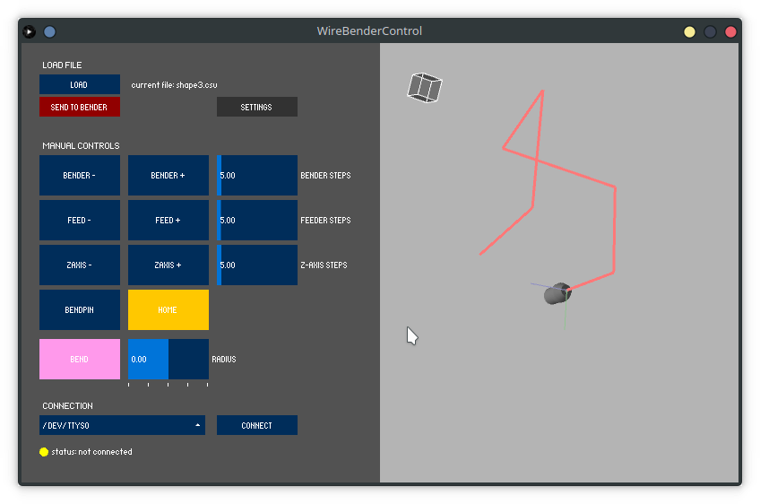

### Control Software for Arduino 3D-Wire-Bender based on Processing
This Processing sketch allows to control a [3d-wire-bending](https://howtomechatronics.com/projects/arduino-3d-wire-bending-machine/) machine designed by [How To Mechatronics](https://howtomechatronics.com/) given the associated [firmware](https://github.com/martinfg/WireBenderArduino) is installed on the arduino.



## Installation
Clone the repository and run the sketch in the [Processing](https://processing.org/) environment by opening `src\WireBenderControl\WireBenderControl.pde`.

To make it a stand-alone executable, Processing allows you to export a program for your specific operating system within the Processing IDE. 

## Features
This software provides a rudimentary interface to communicate with the machine. Features include:
* manually controlling all stepper motors and servos (feeder, bender, bender rotation, bend pin)
* setting step sizes for all manual controls
* make a single bend
* loading shapes as csv (for format, see [Shapes](#import-shapes))
* 3d rendering of imported shape
* calculating necessary steps to bend wire to certain shapes
* send instructions to bender in order to bend shape 

## Usage
### General
You need to upload the [firmware](https://github.com/martinfg/WireBenderArduino) to the arduino that provides a serial communication interface to communicate with the software. 

Next you need to find the USB-port your arduino is connected in the ports list, select it and connect to it. 

If a connection could be established, you will be able to move all the machines stepper and servo motors manually. 

Since our build of the machine does not have the limit switch installed, you'll have to set the home position of the bending head manually. The home position needs to be set in order to be able to make a automatic bend or send a sequence of instructions to the bender.

### Import shapes
To import a path defined by a set of points into the software, press the **LOAD** button and select a csv-file following this format:

```
x,y,z
0.0, 0.0, 0.0 
10.0, 0.0, 0.0
20.0, 10.0, 0.0
...
```
(for some examples shapes see [examples](./data/examples))

The software will calculate each individual step needed to achieve this shape by bending the wire. 

By pressing **SEND TO BENDER** the instructions are sent to the bender and the wire will be bent accordingly. 

### Simulation of result
The 3d view shows a simulation of the wire after it has been bent into shape. 

The view can be navigated by using the mouse, where the mouse wheel zooms in / out and the left mouse button will rotate the camera when pressed. 

### Settings
The [config file](./src/WireBenderControl/data/config.json) defines some constants the arudino firmware uses when executing instructions. 

Most of them are some numeric constants by which some value will be multiplied in order for bending angles or feed distances to match their actual radius / length. So for example, the `FEEDING_CONSTANT` can be adjusted to calibrate the feeder. 

Choose a higher value, and the feeder will feed more wire. The correct values for those constants depend on the actual machine (e.g. diameter of feeder head) so determine them by trial and error. 

In order to adjust the values, open the `config.json` in any text editor, change the values and save them back to file. In the _WireBenderControl_ window you can then go to **SETTINGS** and update by pressing **RELOAD**. This will send all the constants to the arduino.

A short description of the adjustable parameters can be found below.

```
"DEFAULT_PORT"              : "< default Port of the Arduino - will be set on program start >",
"FEEDING_CONSTANT"          : < affects the amount of wire fed for 1 unit >,
"Z_ANGLE_CONSTANT"          : < affects the angle the bending head rotates for 1 unit >,
"OFFSET_FOR_NEG_BEND"       : < affects the amount the bend pin travels when switching sides in order to perfom bend with negative radius >,
"BEND_ANGLE_CONSTANT"       : < affects the angle for a bend with radius bigger than 0 >,
"NEG_BEND_ANGLE_CONSTANT"   : < affects the angle for a bend with radius smaller than 0 >
```

## Limitations
This software was developed for a university project and should be considered rather prototypical. Furthermore, it will not be maintained. Below is a list of known shortcomings and features that i did not manage to implement in the little time I had. 

* The code needs some refactoring, for sure.
* No support for a hardware limit switch for setting the home position of the bender head is provided 
* The way the bending instructions are calculated can be improved by using a more sophisticated approach for determining the direction of rotation for the z-axis.
* The way instructions are sent to the bender could be optimized, and an option should be implemented that allows for stopping a sequence.
* Animation of the bending process.
* Checking for collisions of the wire with the machine could be implemented rather easily and would be beneficial since the biggest shortcoming of the machine by design is that the bending head often collides with the already bent wire when rotations about the z-axis are performed.
* ...  
